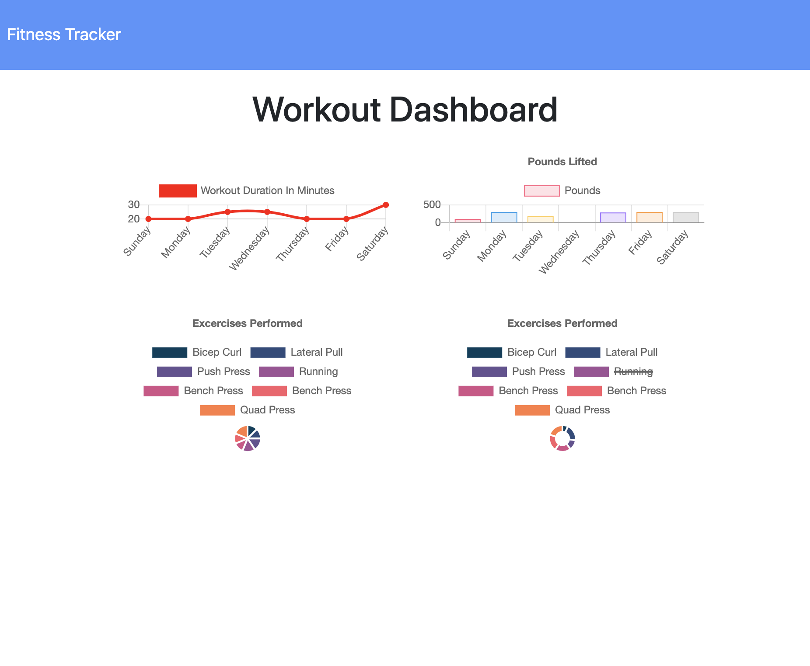
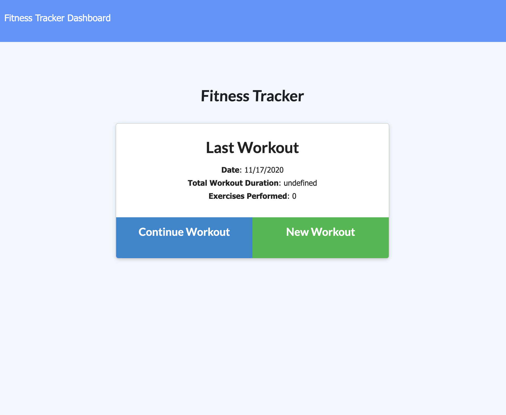

# "Gym-Buff" A Workout Tracker
# **Description**
This is an application designed to allow the user to create and keep track of their excercises. 

## 
## 

# **Installation**
N/A

# **Usage**
This application allows the user to keep track of their daily workouts by creating new workouts or editing a previous one. The user can then view a detailed stats page of their previous workouts.

# **Technologies Used**
This project uses Javascript, HTML, CSS,  mongoDB and Mongoose.

# **Credits**
This website was created by me, but could only have been done with the help of my instructor, TA’s, my tutor, and classmates. In that way, it was a collaborative effort. 

# **License**
N/A